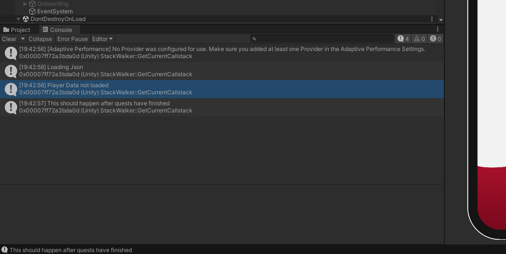

# Eagle Adventures Mobile Application
#### Created by Morgan Whapeles, Jessica Doner, and Johanne McClenahan

#### Table of Contents  
[Team Members and Roles](#team-members-and-roles)  
[Background](#background)  
[Features](#features)  
[How to Run](#running-this-project) 
[Technologies Used](#technologies-used)  
[Hardships](#hardships)   
[Achievements](#achievements)  
[Conclusion](#conclusion)   
[Media](#media)

## Team Members and Roles
1. Jessica Doner: Idea Person
2. Morgan Whapeles: Graphics / UX Designer
3. Johanne McClenahan: Developer? (Not comfortable saying that I am one but...)

### Background
In June 2023, I was contacted by Jessica to work on a project called *Eagle Adventures*. The main idea of the project was to create a mobile application for students participating in Eastern Washington University's Summer Bridge 2023 Camp.

This project was originally pitched as a senior capstone project during Winter Quarter 2023. The scope was to create a campus-wide app for the entire school population, to be done in Microsoft PowerApps and also utilizing SharePoint. However, this project was not selected for the Capstone class and remained dormant for the majority of the rest of the school year.

Somewhere between the project's dormancy and its revival, Jacqueline Coomes, Interim Vice Provost of EWU, became interested in the project. It evolved into a smaller app meant to be used for the Summer Bridge program at EWU. Jessica and Dr. Coomes worked it out so that student workers would be hired to help finish the project. As Doner had already done a lot of work on it in PowerApps, I was one of the workers hired, hence why I am writing this `README.md` right now.

One of the most radical shifts that the project took was that Jessica wanted to move away from PowerApps and instead use Unity. The thought process behind it was that PowerApps was somewhat clunky to work with and was made for only certain types of applications, which Eagle Adventures did not fall into. Morgan also expressed limitations of PowerApps on the design side, as there was limited freedom for designing its UX/UI. I, myself, had run into issues working with Doner's existing PowerApps project, so I thought that Unity could also be a nice change, as I was the primary person working on the coding aspect of this project. That would mean I would have to learn how to use Unity.

### Features
Here are the features of the app (that I can remember):
1. A user can create a local profile that will store their quest progress. This includes creating a name and picking which Summer Bridge group they are in.
2. A user can do various quests related to different departments at Eastern Washington University.
3. A user can level up and gain XP and Coins.
4. A user can redeem coins at the end of the event by entering various codes that relate to real-life prizes.
5. A user, if given a special code, can redeem it and gain extra coins. However, this code is single-use for that given player.
6. A user can click on various links including EWU's Summer Bridge website and its corresponding Canvas page.

### Non-App Related Features
#### Quest Submissions
Using a Google Form, an EWU Faculty member could submit a Quest to be put into the app. This form would then be parsed using the Google Forms library and then sent to Firebase database where it would be used within the app.

The faculty member who submitted the quests as well as team members would get a custom email stating all the quest details as well as the new completion code that users would enter in to complete quests.

### Technologies Used
Although this project was in Unity, a variety of other technologies were used as well. Here is a list of them and a brief description of what they were used for.
#### Unity:
This is the game engine in which I made the app.
#### C# / .NET
Unity's language that is used is C#, so I coded all of the script files within it.

#### HTML / CSS
HTML and CSS were used to format the automated emails that were sent out to EWU faculty confirming their quests have made it into the app and giving them the confirmation code.

#### Google AppScript
In order to send data from the Google Form to Firebase, I used AppScript to retrieve the form submissions and used a Firebase library to send the data to the Firebase Realtime database that stored all the quest details.

Sending emails was also done using AppScript where I created functions that would send emails out to involved parties when a given quest was submitted.

#### Firebase Realtime Database
The Firebase Realtime Database was used to store data of Quests to be used within the App. The database itself was a NoSQL Document-Based solution.

### Running this Project
As stated before, this project has been tested to work on iOS, Android, and Desktop. Instructions on running this app on iOS and Android are coming soon. Here are the instructions:

<B>NOTE</B>: Although it can be run on Desktop, it was designed to be run on Android/iOS. As a result, I would suggest using the [device simulator](https://docs.unity3d.com/Manual/ios-device-simulator.html) to view and run the app.

#### PC
1. Clone this repo onto your local machine.
2. Ensure that you have the latest version of Unity installed.
3. When opening the project, you may find that there is no scene loaded. Navigate from Unity Editor's project window and go to `Eagle-Adventures\Assets\Scenes\`. There will be a file named `Eagle Adventures.Unity`. Click this file and you should see the following screen.

4. Due to size limitations, the Firebase SDK was not supplied in this repo and will instead have to be manually added to the project. In order to do this, you must go to [Firebase's Instructional Guide](https://firebase.google.com/docs/unity/setup) on adding the Firebase SDK packages to this project. You can verify your installation when by loading the app. An error saying you are missing a DLL file will appear in place of `Player Data not loaded` within the Console.

5. From there, enjoy using the App!

#### Testing Features Out
Here are some notes for testing the app:
1. Codes to test for quest completion can be found in [Quests.json](/docs/quests.json). That way you can check how completion works for each question.
2. Use the code `DELETEPLAYERDATA` to reset the player data stored within the game to check out onboarding part again.
3. Use the code `LEVELTONINE` to check out the level-up system leveling the player up to Level 9.

### Hardships

#### Time Constraint
As I was the only one who was coding this app, it became very draining. This was originally supposed to be a Senior Capstone project done by four computer science students over the span of 7 months. Instead, it was done by one student in 3 months. This wasn't helped by the fact that I had to learn Unity and C# as well as Firebase within the same time

 span.

#### Coordination with Sponsor
The client of this project had a hard time figuring out what the direction of the project was. As a result, it became a lot of the team having to constantly retool the app to include or exclude features and ideas. This removed time from making sure the app was bug-free.

#### No Testing
This is a major issue that I wish I could've addressed. There is not testing at all for this project. The majority of it was testing using Console debugging and live testing. I should have done more research into how to test C# and Unity as it would've made my life 100% easier.

### Achievements

#### Learning C#
One of the interesting parts of this project was learning C#. Although it is similar to Java, it has a lot of differences. I found it enjoyable but also difficult. Concepts such as Properties and LINQ were very interesting to learn about and use.

I also experimented with using lambda expressions and generics. One of the coolest things that I did was create a simplistic deserializer. I did this when I was reading about reflection and also about how the `Newtonsoft` JSON library worked. I made it so that the method `DeserializeObject<T>()` would take in a generic of type `T`. It would get a list of properties of the type `T` and then iterate through them and create a list of `T` of deserialized objects. Although it wasn't perfect, it was very interesting to try and replicate already existing code to see how it really worked.

As I have gotten more exposure to C#, it's cool to see how much I've changed when it's come to coding in it.

#### Improving Object-Oriented Programming knowledge.
This project helped me get better at my understanding of OOP. Because I didn't know if this project was going to be picked up again, I tried to make sure that I programmed it well. The most important thing I learned was to figure out how to slim the code down. 

An example within the project is the Quest Tiles. The original quest tile design made it so that the `QuestManager` had to create a single list of tiles that would be displayed to the user. This was bad because it relied on `QuestManager` to create its tiles for the UI when it shouldn't. As a result, I slowly reworked the code to where tile creation was designated to its own class. I also tried to make it so that all a user had to do was call `QuestTileConstructor.CreateTiles()` with a list of quests and a parent game object and it would create fully functional quest tiles without any extra setup.

#### Documentation
This project really showed me how important it was to document progress whether that be through commits in GitHub or code comments. I tried my best to leave comments explaining how things worked so that Jessica or Morgan could look at my code and understand what was happening with it. 7 months later and having these comments help with updating the `README.md` file.

#### Team Communication and Managing Requirements
This was my first real project working with a team and despite the hiccups, I feel like I did a good job trying to communicate and work with the team. Morgan and I met up almost every week during the project to make sure that I was making your design as close to the mock-ups as I could.

I also think I improved with communicating with sponsors. Having to work with non-computer science people made me realize how hard it is to create a product that the sponsor will like. I wasn't good at working to maintain good requirements at the start. But I do feel like I got better by the end of the project in trying to work with the sponsor to create realistic features and goals for the team.

### Conclusion
I am reading this write-up in February 2024, which means it's been around half a year since I did this project. I would say it was one of the hardest projects I've ever worked on, but I'm very proud of what I was able to do within the two months. I am still upset that we couldn't get it fully there at the end, but it was amazing to have it running on my own phone.

### Media

#### Screenshots

Here are sreenshots of the app running via the built-in player in Unity:

 
 
 
 

